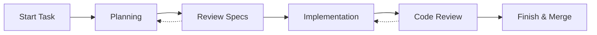

# Mehrhof

Mehrhof is a CLI tool for AI-powered task automation. It orchestrates AI agents (calling Claude CLI) to help you plan and implement software development tasks.

## Key Features

**AI-Powered Workflow**

- Automatic planning: AI analyzes your task and creates detailed specifications
- Code implementation: AI generates code based on approved specs
- Code review: Automated review of changes before merging

**Git Integration**

- Automatic branch creation for each task
- Checkpoint system for safe experimentation
- Undo/redo support for all changes
- Squash merge for clean history

**Flexible Task Sources**

- Markdown files describing requirements
- Directories containing multiple task files
- GitHub issues (fetch, list, create, update status, manage labels, comments)
- Standalone planning without formal tasks

## How It Works



1. **Start** - Register a task from a file or directory
2. **Plan** - AI creates implementation specifications
3. **Implement** - AI generates code based on specs
4. **Review** - Automated code review (optional)
5. **Finish** - Merge changes to your target branch

## Quick Example

```bash
# Create a task file
echo "# Add User Authentication
Implement JWT-based authentication with login/logout endpoints." > task.md

# Start the task (creates branch, registers task)
mehr start file:task.md

# Generate implementation plan (calls Claude CLI)
mehr plan

# Implement the specifications (calls Claude CLI)
mehr implement

# Complete and merge
mehr finish
```

> **Note:** The `file:` prefix specifies the provider scheme. You can configure a default provider in `.mehrhof/config.yaml` to omit it.

## Next Steps

- [Quick Start Guide](getting-started.md) - Get up and running in 5 minutes
- [Installation](installation.md) - Install Mehrhof on your system
- [CLI Reference](cli/overview.md) - Complete command documentation
- [Tutorials](tutorials/first-task.md) - Step-by-step guides
